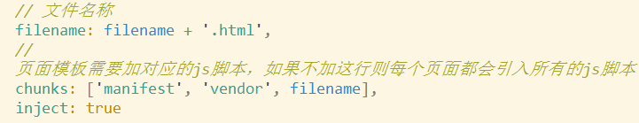

[TOC]

## history模式[（官方文档）](https://router.vuejs.org/zh/guide/essentials/history-mode.html#%E5%90%8E%E7%AB%AF%E9%85%8D%E7%BD%AE%E4%BE%8B%E5%AD%90)

:warning:vue-router中有个滚动行为，hash不能使用，但是history可以实现

- 如果不希望看到丑陋的 #（hash模式） 可以使用history模式 ， 其原理**依赖于 history.pushState函数⭐️**


- a标签点击以后，如果没有# 必然会页面跳转发起请求，只要有#就不会跳转
- 使用**pushState函数可以改变url**（ **比如  /abc ）而不会发起请求**，
- 只有调用go || forward函数，才会根据历史记录切换页面，切换的过程会触发popstate事件

- js通过location.pathname获取该值 /abc  做页面局部的替换 

### 1 router-view的history简单实现原理


Vue.use()时会监视hashchange或popState

Vue.use()初始化，给_router添加监视，更改后更新视图

> **在例子中进行尝试**
>
> 1. 向router中添加一行
>
>    ```JavaScript
>    const router = new VueRouter({
>      mode: 'history',
>      routes: [...]
>    })
>    ```
>
> 2. :warning:配置后端，在根目录下新建node_history_server.js文件，插入内容，内容来自于vue-router官网，但需要添加相应的代码，如下方注释所示
>
>    ```JavaScript
>    const http = require('http')
>    const fs = require('fs')
>    const httpPort = 80
>    
>    http.createServer((req, res) => {
>         //添加开始
>        if (req.url.startsWith('/js') || req.url.startsWith('/css')) {
>            fs.readFile('.'+req.url,(err,data) =>{
>                res.end(data)
>            })
>            return
>        }
>        //添加结束
>        
>       // 注意此处的htm，要改为html
>      fs.readFile('index.html', 'utf-8', (err, content) => {
>        if (err) {
>          console.log('We cannot open "index.htm" file.')
>        }
>    
>        res.writeHead(200, {
>          'Content-Type': 'text/html; charset=utf-8'
>        })
>    
>        res.end(content)
>      })
>    }).listen(httpPort, () => {
>      console.log('Server listening on: http://localhost:%s', httpPort)
>    })
>    ```
>
> 3.  npm run build 启动生产模式后，生成dist文件夹，将上述文件剪切进dist中
>
> 4. 命令行中启动服务器，**在dist目录下**:warning:：D:\github\plugin_mixin_vuex_config\dist>nodemon .\node_history_server.js
>
>    > **此处需要安装nodemon**，命令行中全局安装：npm install -g nodemon
>    >
>    > - 安装完 nodemon 后，就可以用 nodemon 来代替 node 来启动应用：
>    >
>    > ```
>    > nodemon [your node app]（相当于 node [your node app]）
>    > ```
>    >
>    > - 如果没有在应用中指定端口，可以在命令中指定：
>    >
>    > ```
>    > nodemon ./server.js localhost 8080
>    > 
>    > ```
>
>     启动成功后：
>
> 5.   点开链接，就看到了之前的页面，并且链接已经没有#了！！
>
>    


* router-view实现图解
  * 


#### 自制webpack插件实现骨架屏

* 
* 原理分析：
  * 1: 从路由A跳到路由B慢不慢？  你敢说慢？ 因为A的时候各种js已经加载好了ok
  * 2: 那到底是什么比较慢 ？ A的首次加载
    * 慢会带来什么？
      * 1: 首屏白屏(量太大，渲染好久)
      * 2: 首屏卡顿(加载一半，一半卡住)
    * 解决方案：
      * 1: 客户端太慢，渲染容易卡住。。 服务端渲染好页面，客户端就加载个html完事
      * 2: 白屏也不错，但是如果能有个骨架屏，看起就爽了
* 插件实现思路
  * 
  * 需要在vue的执行代码加载之前，先让用户看到骨架屏，带app代码执行 new Vue() 替换<div id="app"></div> 就好了
  * 决定加载什么js的是index.html,操作他的插件是html-webpack-plugin
  * 我们让自己的插件再其后操作，并根据其留下的数据入口获取数据并更改
* 效果预览
  * html
    * 
  *  后续逻辑
    * 
  * 再来卡顿
    * 


* 插件代码

  * ```js
    let MyPlugin = function (options) {
      this.template = options.template;
    }
    
    MyPlugin.prototype.apply = function (compiler) {
      // console.log(compiler);
      console.log('我们的插件被执行了');
      // 先指定自己怎么编译，根据别人的编译结果操作
      compiler.plugin('compilation', compilation => {
          
          compilation.assets['./tjx.txt'] = {
              size:function () {
                  return 'abc'.length;
              },
              source:function () {
                return 'abc'
              }
            }
          
          
          	// 别人编译的入口
              compilation.plugin('html-webpack-plugin-before-html-processing',(htmlData,callback) => {
                  // html-webpack-plugin中间插入行为的地方
                  htmlData.html = htmlData.html.replace(`<div id="app"></div>`,`
                    <div id="app">
                      <div style="background-color:red;height:300px;display:none;" id="default" >
                          我是默认的骨架屏
                      </div>
                      <div style="background-color:red;height:300px;display:none;" id="user" >
                          我是user的骨架屏
                      </div>
                      <div style="background-color:red;height:300px;display:none;" id="login" >
                          我是login的骨架屏
                      </div>
                    </div>
                    <script>
                          var hash = window.location.hash;
                          var path = window.location.pathname;
                          if (path === '/login' || hash === '#/login') {
                            document.getElementById('login').style.display = 'block';
                          } else if (path === '/user' || hash === '#/user') {
                            document.getElementById('user').style.display = 'block';
                          }
                    </script>
                    `);
                  // 不论如何两个参数，错误在前
                  callback(null,htmlData);
    
              });
    
      });
    }
    module.exports = MyPlugin;
    ```

  * 使用插件（接着html插件）

    * 


#### 多页应用

* 核心思想: 其实就是两个vue项目，一次webpack打包，关联用url联系
  * webpack操作:
    * 1. 多个入口 {  main1:'./usermain.js',main2:'./goodsmain.js'  }
      2. 多个html插件
* 注意事项
  * 
* getHtmls的思路
  * 更为灵活的读取各项目下的js文件（入口）  entry:{‘js文件名’:'js文件路径' } 
  * 更为灵活的读取各项目下的html文件（首页.html） ``` plugins:[].concat(   [   new HtmlWebpackPlugin(),new HtmlWebpackPlugin()    ]    )```
    * filename属性是生成的相对dist的文件名  xxx.html
    * template 模板生成的参照物  需要绝对路径||相对路径 './xxx.html'
    * chunks:[filename]   指定第三引入的js文件名称
    * 
      * 这个[name]其实就是entry的key

